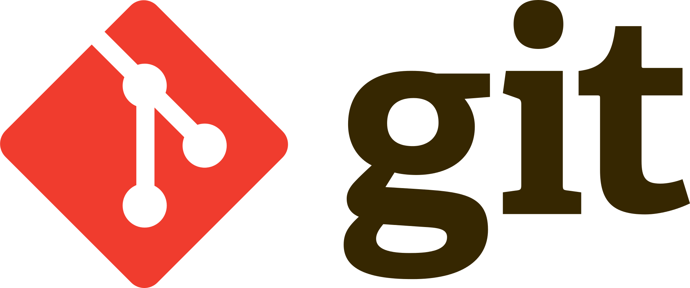

# GitHubin ohjeet:
- Git peruskomennot:
> ## git add 
> Listätään työskentelyhakemistossa tehdyt muutokset valmistelualueelle eli indeksiin (stage).
> ## git commit
> Sidotaan valmistelualueelle lisätyt muutokset pysyväksi muutokseksi eli solmuksi (commit) paikalliseen repositorioon.
> ## git status
> Näyttää viimeisimmän pysyvän muutoksen (commit) jälkeen tehdyt muutokset.
> ## git push
> Lähetetään pysyvät muutokset paikallisesta repositoriosta etärepositorioon.
> ## git branch <<a>uuden haaran nimi>
> Luo uuden haaran, jonka sisältö on sama kuin senhetkisen haaran. Pelkkä **git branch** näyttää projektin haarat.

- Muita hyödyllisiä komentoja:
> ## git checkout <haara>
> Siirtyy annettuun haaraan sekä muuttaa työkopion sen mukaiseksi.
> ## git revert
> Luo uuden commitin, joka peruu edeltäjänsä.
> ## git reset
> Indeksiin lisättyjä yksittäisiä tiedostoja saa poistettua komennolla **git reset <<a>tiedosto>**

### Miten kytket paikallisen Git työhakemiston GitHub ympäristöön. Miten lähetetä tietoa paikallisesta työhakemistosta GitHub:n. Miten haet tietoa Github:a paikalliseen työhakemistoon.
- Tämä vaihe tehdään vain kerran siinä tilanteessa, että etätietovarastoa ei kopioida (kloonata) vaan on kyseessä paikallinen tietovarasto. Tässä tilantessa usein halutaan kertoa mihin etätietovarastoon olemassaoleva paikallinen tietovarasto halutaan työntää. Muita tilanteita ovat esimerkiksi sellaiset, että paikallinen tietovarasto muutoshistorian kanssa halutaan työntää toiseen uuteen etätietovarastoon. Käyttötapauksia on monenlaisia.

> Esimerkissä voidaan olettaa, että työhakemiston polku on:
>
> C:\repositoryt\GitHarjoitukset\
> 
> Anna työhakemistossa alla oleva komento, joka lisää viittauksen etätietovarastoon. Origin on tässä vapaavalintainen etätietovaraston nimi, jota tarvitaan muutoksia työntäessä myöhemmin. Origin on aina usein oletuksena annettu nimi.
> 
>> **git remote add origin <<a>osoite git repositoryyn>**
>
> Tarkista komennon antamisen jälkeen, että näet lisätyn viittauksen seuraavan komennon avulla.
> 
>> **git remote -v**

- Tämä vaihe tehdään vain kerran siinä tilanteessa, että etätietovarasto on jo olemassa ja sitä ei ole nykyisellä työasemalla (työkoneella) olemassa vielä. Etätietovarasto on siis perustettu jo toisen henkilön toimesta.

> Esimerkissä voidaan olettaa, että työhakemiston polku on:
>
> C:\repositoryt\
> 
> clone komento kopioi sille annetusta URL osoitteesta tietovaraston paikalliseksi tietovarastoksi. Merkit < ja > eivät kuulu komentoon. Komennon antamisen jälkeen usein pitää tunnistautua riippuen käytettävästä palvelusta.
>
>> **git clone <<a>osoite git repositoryyn>**
>
> Navigoi komennon jälkeen clone komennon luomaan kansioon.
> 
>> **cd kansion_nimi**
